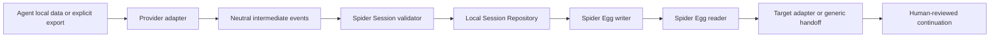

# Spider Web Architecture (Phase 0)

## Purpose and boundaries

Spider Web moves durable task state between coding agents. It is a local interoperability tool, not an agent runtime, hosted service, or dependency of Spider Agent. It must not claim to restore another vendor's private internal thread unless that vendor exposes a supported import/resume mechanism.

## Layers

```text
CLI
 ↓
Session orchestration + Import / Export / Conversion API
 ↓
Provider adapters ── Claude | Codex | Cline | Cursor | Antigravity | generic
 ↓
Canonical Spider Session model + validator
 ├── Local session repository
 └── Spider Egg reader / writer
```

The adapter boundary owns provider-specific paths, parsers, event vocabularies, metadata, and resume behavior. The core owns provider-neutral data and conversion policy. The repository owns platform-aware local persistence and indexes. Egg IO owns portable package validation and serialization. The CLI orchestrates these interfaces and reports actual capability, not aspiration.

## Phase 0 technology decision

Target Node.js 22 or newer and TypeScript ESM for the CLI ecosystem requested by the product brief. Use a small TypeScript package rather than a monorepo until multiple independently versioned packages are justified. Build with `tsc`; use Node's built-in `util.parseArgs` (no runtime CLI framework), ESLint flat config with `typescript-eslint`, Prettier, and Vitest. JSON Schema 2020-12 is the source of truth, validated with Ajv strict mode plus `ajv-formats`; derive static types from the schemas. Use `canonicalize` for RFC 8785, pinned `yazl` for writing, pinned `yauzl` for reading, and Node `crypto` for SHA-256. The Egg's byte-level profile is the contract; archive fixtures must confirm the libraries honor it across Windows, Linux, and macOS. npm package name `spider-web` is provisional until registry availability can be checked.

## Canonical session principles

- Version the schema and reject unknown major versions with an actionable error.
- Represent messages, tool calls, tool results, decisions, artifacts, commands, tests, blockers, and next action using neutral names.
- Keep source agent identity in session provenance; provider-native IDs and opaque fields go in `extensions.<adapter-id>`.
- Record provenance and confidence where information is inferred. Never fabricate outcomes or decisions from absence.
- Treat the live repository and Git worktree as authoritative for current Git state; transcripts alone cannot reliably reconstruct modifications. Keep `files` (attributed file actions) separate from `git.files` (observed index/worktree status).
- Preserve unknown extension fields during read/write conversion.
- Keep full captured data distinct from compact handoff rendering. Handoff is a derived view, never the sole stored copy.

## Import pipeline

1. Discover only through explicit user command or a narrowly scoped adapter detector.
2. Read source data read-only; check file size, format, and path boundaries.
3. Parse to a provider-specific intermediate representation.
4. Normalize supported evidence into Spider Session; retain unknown provider fields in extensions only where safe and useful.
5. Optionally snapshot Git metadata read-only and separately from transcript claims.
6. Validate and store locally. Report omissions and truncated content.

Capture must not execute source commands, mutate agent history, stage/commit/reset Git, or package project files implicitly.

## Export / continuation pipeline

1. Validate Egg and schema, then render a compact handoff with state before history.
2. Ask for explicit inclusion of attachments or sensitive artifacts.
3. Call the target adapter only for a declared capability. Native resume, native import, export format, and generic handoff are distinct capabilities.
4. For Codex 0.1, provide a Markdown handoff and a documented/manual CLI continuation command. Do not edit Codex's private rollout files or claim thread migration.

## Local storage decision

Use standard platform data locations through Node path/OS APIs: Linux `$XDG_DATA_HOME/spider-web`, falling back to `~/.local/share/spider-web`; macOS `~/Library/Application Support/spider-web`; Windows `%LOCALAPPDATA%/Spider Web` (OS home-directory fallback only if the environment variable is absent). Config uses Linux `$XDG_CONFIG_HOME/spider-web` or `~/.config/spider-web`, macOS `~/Library/Application Support/spider-web/config`, and Windows `%APPDATA%/Spider Web/config`. The data root contains `sessions/<id>/session.json`, `eggs/`, `cache/`, and `logs/`; config is separate. An atomic, private local index stores absolute project roots separately from portable session data. The Spider Session is one canonical file, so no duplicate events log is needed. Logs exclude content by default. Writes use temp file + atomic rename, restrictive user permissions where supported, and refuse silent overwrite.

Session IDs are `spw_` plus Node-generated UUID v4. Capture reads only the selected agent data and target project; the only writes are new Spider Web records.

## Data flow



## Rejected approaches

- One transcript-shaped core model: each agent's storage has different omissions and event semantics; transcript-only handoff loses filesystem and test state.
- Writing directly into another agent's private session DB/JSONL: unsupported, version-sensitive, and risks corrupting user sessions.
- Treating a matching file extension as a stable contract: implementations can change without compatibility guarantees.
- Automatically attaching a whole project or conversation: violates minimization and exposes secrets.
- Cloud sync or AI summarization in 0.1: outside the local-first objective and creates unnecessary privacy/dependency concerns.

## Risks and unknowns

See [agent research](docs/agents/), [protocol](PROTOCOL.md), [decisions](DECISIONS.md), and [security](SECURITY.md). Highest risks are undocumented storage churn, transcript omission of actual execution, sensitive transcript export, incomplete write/test attribution, and confusing generic prompt injection with native resume. These are disclosed limits, not reasons to weaken the provider-neutral core.
