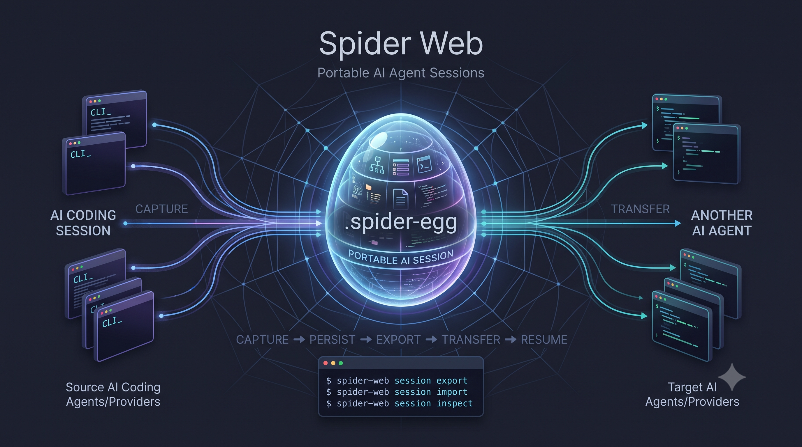

# Spider Web

**Spider Web connects AI agents. Spider Egg carries their session state.**



Spider Web is a provider-neutral interoperability layer for AI coding-agent sessions. It captures the structured working state of an agent run into a standard session model and packages it into portable `.spider-egg` archives.

Spider Web is **not** an AI coding agent. It does not generate code, chat with users, or run models directly. Instead, it provides a CLI and protocol to record, inspect, package, and hand off task state between different coding agents without losing progress or relying on cloud services.

## What is Spider Web?

AI coding agents often perform complex, multi-step engineering tasks: exploring a codebase, deciding on an approach, editing files, running test suites, and troubleshooting errors.

Spider Web tracks this work as it happens, normalizes it into a vendor-neutral format, and makes it portable. Whether a session is paused, interrupted, or transferred to another agent, Spider Web preserves the actual state of the task—what was planned, what was completed, and what remains to be done.

## The Problem

When you work with AI coding agents like Claude Code or Codex, sessions inevitably hit boundaries:

- A model reaches its token limit or context window capacity.
- A provider account hits a rate limit or budget quota.
- An agent gets stuck in a loop or reaches a turn limit.
- You want to switch to a different model or specialized tool for the next step (for example, handing off from an exploratory agent to a targeted refactoring agent).

Today, developers face two bad choices:

1. **Start over from scratch:** Prompt a new agent from zero, losing all context about completed work, investigated paths, failed attempts, and project decisions.
2. **Dump the entire conversation transcript:** Copy and paste thousands of lines of raw conversation history and tool outputs into a new window. This wastes context window tokens, confuses the receiving model with obsolete tool payloads, and forces the model to guess which tasks are finished and which remain open.

Spider Web solves this by focusing on the **state of the work**, not a transcript dump.

## How It Works

```text
AI Coding Agent (e.g., Claude Code)
        ↓  (live run & event normalization)
  Spider Session  (canonical local session.json)
        ↓  (portable archive export)
   Spider Egg  (.spider-egg archive with handoff.md)
        ↓  (structured handoff prompt)
AI Coding Agent (e.g., Codex CLI)
```

1. **Live Execution & Recording:** Run an agent through Spider Web (`spider-web agent claude run` or `spider-web agent codex run`). Spider Web executes the agent, normalizes streaming events in real time, and persists the session incrementally to local disk.
2. **Canonical Session:** The session captures what actually happened—objectives, file edits, executed commands, test results, and next actions—in an open, vendor-neutral format.
3. **Spider Egg Packaging:** When you need to move or share the session, export it as a `.spider-egg` archive containing the canonical session, an integrity manifest, and a deterministic `handoff.md`.
4. **Structured Handoff:** Pass the compact handoff brief to another agent (`spider-web session continue` or `spider-web session handoff`). The incoming agent receives clear instructions on what is already finished and what remains to be done, without polluting its context window.

## Spider Session

A Spider Session represents a single, complete unit of engineering work. It is stored as a canonical JSON document (`session.json`, schema version `1.0`).

Unlike a raw conversation transcript, a Spider Session extracts and maintains structured working context:

- **Objective:** The overall goal and lifecycle status (`in_progress`, `blocked`, `completed`, `unknown`).
- **Working state:** Current task, completed work items ("do not redo"), pending tasks, and blockers.
- **Decisions:** Architectural and implementation decisions recorded during the run.
- **File evidence:** Files created, modified, or deleted with change attribution.
- **Command & Test evidence:** Commands executed, their exit codes, and test outcomes.
- **Errors:** Specific blockers and errors encountered during execution.
- **Next action:** The immediate recommended next step.
- **Conversation:** Normalized messages with explicit relevance flags (`handoff_relevant`) so models only receive pertinent exchanges.
- **Provider metadata:** Provider-specific identifiers (such as Claude SDK turn IDs or Codex thread IDs) stored safely under `extensions.<provider>` without polluting the neutral core.

## Spider Egg

A Spider Egg (`.spider-egg`, schema version `0.1`) is the portable archive representation of a Spider Session.

It is a deterministic, uncompressed ZIP container (using standard ZIP format with `STORED` compression) designed for offline archiving, cross-machine transfer, and agent handoffs.

Each Egg contains:

- `manifest.json`: Content-addressed SHA-256 hashes, entry sizes, and schema metadata.
- `session.json`: The canonical Spider Session document.
- `handoff.md`: A deterministic, compact Markdown brief formatted specifically for consumption by an incoming AI agent or human reviewer.
- Payload artifacts (optional): Explicitly selected file artifacts.

### Safety and Privacy

- **Sensitive content confirmation:** Exporting and importing preview session and artifact counts, requiring interactive confirmation (`[y/N]`) or the explicit `--confirm-sensitive` flag. Transcript text is not echoed to the terminal.
- **Never executes commands:** The Egg reader strictly validates archives and parses data into memory or local storage. It never executes commands, modifies Git history, or touches working directory files.
- **Archive safety:** Enforces strict limits (max 2,000 files, max 256 MiB expanded payload), rejects path traversal (`..`, absolute paths, drive letters), rejects compression methods other than STORED, and validates canonical UTF-8 filenames.

## Supported Agents

Spider Web integrates with agents through concrete, documented adapter boundaries.

| Agent           | Integration                                                  | Live Run  | Session Recording       | Cross-Agent Handoff         | Native Resume                  | Historical Import |
| --------------- | ------------------------------------------------------------ | --------- | ----------------------- | --------------------------- | ------------------------------ | ----------------- |
| **Claude Code** | Official Claude Agent SDK (`@anthropic-ai/claude-agent-sdk`) | Supported | Supported (incremental) | Supported (as source)       | Not supported*                 | Planned           |
| **Codex CLI**   | Documented CLI stream (`codex exec --json`)                  | Supported | Supported (incremental) | Supported (source & target) | Supported (`--resume-thread`)* | Planned           |

### Understanding Integration Boundaries

- **Live Run:** Spider Web invokes the agent process or SDK, monitors its execution stream, and captures events as they happen.
- **Session Recording:** Events (messages, tool calls, commands, file edits) are normalized and incrementally written to the local session repository.
- **Cross-Agent Handoff vs. Native Provider Resume:**
  - _Cross-agent handoff:_ Spider Web renders a structured continuation brief (`handoff.md`) summarizing the completed work, pending tasks, files changed, and next action. When starting a different agent (or a new session of the same agent), this brief is passed as the initial prompt so the incoming agent knows exactly where to pick up.
  - _Native provider resume:_ Resuming a provider's internal, proprietary thread state. Codex CLI supports resuming its own threads via `--resume-thread <thread-id>`. Claude Code only supports resume internally within Claude Code. Spider Web never claims that cross-agent handoff is native provider resume, and never writes to private provider database files.
- **Historical Transcript Import:** Neither Claude Code nor Codex CLI currently exposes a stable, documented public API for parsing arbitrary historical transcripts from disk. Importing historical transcripts (`session capture claude` / `session capture codex`) is explicitly planned for when reliable contracts exist.

## Installation

Spider Web requires **Node.js >= 22**.

The package is currently maintained as a standalone repository package (`"private": true` in `package.json`, version `0.1.0`). The `spider-web` executable name is linked locally:

```bash
git clone https://github.com/your-org/spider-web.git
cd spider-web
npm install
npm run build
npm link
```

Once linked, the `spider-web` CLI is available globally in your terminal. You can also run commands directly with `node dist/src/cli.js`.

## Quick Start

### 1. Run an Agent and Record the Session

Run Claude Code through Spider Web:

```bash
spider-web agent claude run "Implement JWT validation middleware and add unit tests" --cwd .
```

Run Codex CLI through Spider Web:

```bash
spider-web agent codex run "Fix the failing test in tests/auth.test.ts" --cwd . --sandbox workspace-write
```

Interrupt a running agent at any time with `Ctrl+C`; the session stays stored and inspectable.

### 2. Inspect Stored Sessions

List all sessions in your local repository:

```bash
spider-web session list
```

Inspect details of a specific session:

```bash
spider-web session inspect spw_023e961e-0e17-4497-9153-df24d75951a2
```

### 3. Generate a Structured Handoff

Print a compact continuation brief to stdout:

```bash
spider-web session handoff spw_023e961e-0e17-4497-9153-df24d75951a2
```

Or save it to a file:

```bash
spider-web session handoff spw_023e961e-0e17-4497-9153-df24d75951a2 --output handoff.md
```

### 4. Continue Work with Another Agent

Hand off an existing session directly to Codex in a new provider thread:

```bash
spider-web session continue spw_023e961e-0e17-4497-9153-df24d75951a2 --provider codex --cwd . --sandbox workspace-write
```

Spider Web generates the structured continuation prompt from the session, launches Codex, records the new run, and appends the new events to the existing Spider session.

### 5. Export and Import Spider Eggs

Export a stored session as a portable `.spider-egg`:

```bash
spider-web session export spw_023e961e-0e17-4497-9153-df24d75951a2 session.spider-egg --confirm-sensitive
```

Verify and inspect an Egg archive without extracting it:

```bash
spider-web egg inspect session.spider-egg
```

Import an Egg into the local repository on another machine:

```bash
spider-web session import session.spider-egg --confirm-sensitive
```

### 6. Work with Standalone Session Documents

Validate a standalone session JSON file against schema v1.0:

```bash
spider-web session validate session.json
```

Create a Spider Egg directly from a session JSON file:

```bash
spider-web egg export session.json session.spider-egg --confirm-sensitive
```

Extract the session JSON from a Spider Egg file:

```bash
spider-web egg import session.spider-egg session.json --confirm-sensitive
```

Delete a session from the local repository:

```bash
spider-web session delete spw_023e961e-0e17-4497-9153-df24d75951a2
```

## Local Storage

Spider Web stores sessions locally on your machine using standard platform directories:

- **Linux:** `$XDG_DATA_HOME/spider-web` (falling back to `~/.local/share/spider-web`)
- **macOS:** `~/Library/Application Support/spider-web`
- **Windows:** `%LOCALAPPDATA%\Spider Web` (falling back to `%USERPROFILE%\AppData\Local\Spider Web`)
- **Custom override:** Set `SPIDER_WEB_DATA_DIR` to redirect storage (useful for testing or containerized runs).

### Storage Architecture

- **Canonical session files:** Stored under `<data-dir>/sessions/<session-id>/session.json`. Each file contains the complete session data.
- **Discovery cache (`index.json`):** A lightweight index containing session ID, status, agent, title, project name, and modification timestamps for fast `session list` queries.
- **Self-healing index:** `index.json` is strictly a cache, never the source of truth. If it is missing, malformed, or stale compared to disk modification times, the repository automatically rebuilds it from the canonical session files on the next read.
- **Atomic writes:** Session updates are written to an exclusive temporary file (`.session.json.<uuid>.tmp`), synced to disk, and renamed over the target with retry backoff for Windows sharing violations. A crash never leaves a partially written or corrupt session.

## Security

Spider Web is designed for safe local operation:

- **Confirmation for sensitive data:** Session export and import operations preview item counts and require explicit interactive confirmation or `--confirm-sensitive`. Raw conversation text and tool outputs are not echoed to previews.
- **Non-executing imports:** Importing an Egg only stores session data. It never executes commands found in the session, touches Git, or overwrites working tree files.
- **Provider boundary protection:** Spider Web never edits or mutates provider-private configuration files, rollout databases, or internal state.
- **Codex sandboxing:** Codex runs default to `read-only`. Write access requires `--sandbox workspace-write`. The unrestricted `danger-full-access` mode strictly requires the explicit `--allow-dangerous-bypass` flag.
- **Local-first:** No accounts, no telemetry, no network calls, and no background sync. All session data remains on your machine.

For full security guidelines and threat boundaries, see [SECURITY.md](SECURITY.md).

## Architecture

```text
CLI (src/cli.ts)
  │
  ├── Provider Adapters (Claude Agent SDK, Codex CLI stream)
  │     └── Normalizes provider events into neutral AgentEvents
  │
  ├── Canonical Session Core (src/core/)
  │     ├── Schema v1.0 validation (Ajv strict)
  │     └── Continuation context & handoff prompt builder (src/continuation/)
  │
  ├── Local Session Repository (src/repository/)
  │     ├── Canonical sessions/ directory & atomic writes
  │     └── Rebuildable index.json discovery cache
  │
  └── Spider Egg Archive (src/egg/)
        └── Deterministic, safe, uncompressed ZIP container (yazl / yauzl)
```

For design details and protocol specifications:

- [Architecture specification](ARCHITECTURE.md)
- [Protocol draft](PROTOCOL.md)
- [Adapter boundary rules](ADAPTERS.md)
- [Architecture decisions](DECISIONS.md)

## Project Status

### Implemented

- [x] **Canonical session schema (`1.0`):** Full provider-neutral model covering objectives, tasks, decisions, file evidence, commands, tests, errors, next action, and extensions.
- [x] **Spider Egg archive format (`0.1`):** Deterministic uncompressed ZIP container with canonical JSON (RFC 8785), SHA-256 manifest verification, and path traversal protection.
- [x] **Local session repository:** Platform-native storage, atomic writes, exclusive creation, and self-healing index rebuild.
- [x] **Claude Code live runner:** Controlled live runs via official Claude Agent SDK with streaming event normalization and incremental persistence.
- [x] **Codex CLI live runner:** Controlled live runs via `codex exec --json` with Windows command-shim discovery, sandbox posture enforcement, and streaming event normalization.
- [x] **Continuation & handoff:** Deterministic handoff prompt generation (`session handoff`) and cross-agent continuation into Codex (`session continue <id> --provider codex`).
- [x] **Native Codex resume:** Resuming existing Codex threads via `--resume-thread <thread-id>`.
- [x] **CLI command suite:** Complete set of commands for session inspection, repository management, Egg archive manipulation, and agent execution.

### Planned

- [ ] **Historical transcript import for Claude Code (`session capture claude`):** Planned once a stable, documented local transcript contract is established.
- [ ] **Historical transcript import for Codex CLI (`session capture codex`):** Planned once official rollout parsing is supported.
- [ ] **Native session resume for Claude Code:** Dependent on Anthropic providing an official external session resume mechanism.
- [ ] **Additional agent adapters:** Adapters for Cline, Cursor, Antigravity, OpenHands, and other coding agents (see [agent research](docs/agents/)).
- [ ] **App-server / JSON-RPC transport for Codex:** Bidirectional approval transport and persistent thread control.
- [ ] **Direct Egg continuation:** Continuing directly from a `.spider-egg` file without importing into the local repository first.
- [ ] **Public npm publishing:** Publishing to the npm registry once package name availability is finalized.

## Contributing

Contributions should preserve Spider Web's boundary: a provider-neutral, local-first interoperability layer, not another AI coding agent.

See [CONTRIBUTING.md](CONTRIBUTING.md) for contribution guidelines and agent adapter requirements.

### Development

Spider Web uses TypeScript, ESLint, Prettier, and Vitest.

```bash
npm run typecheck    # Validate schemas and run TypeScript type checks
npm run build        # Build TypeScript source to dist/
npm run lint         # Run ESLint checks
npm run format:check # Verify code formatting with Prettier
npm test             # Run test suite
```

## License

Not selected yet.
